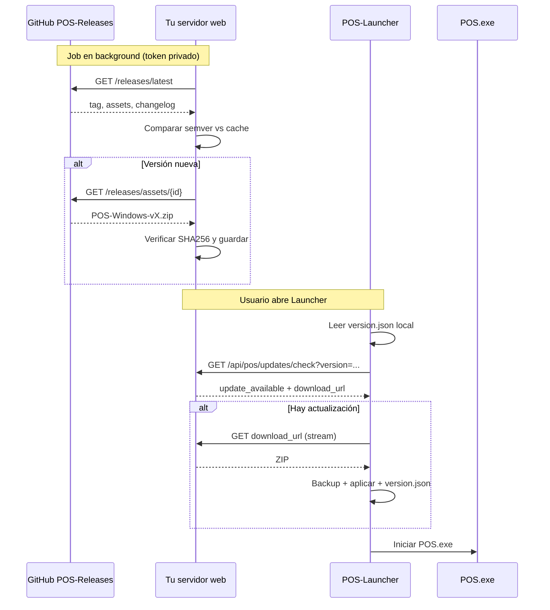

# Migración del sistema de actualizaciones: GitHub → Servidor web

Documento de handoff para implementar en el repositorio de la **web** la lógica que hoy vive en **POS-Launcher** contra la API de GitHub. Otro agente puede usar solo este archivo como punto de partida.

---

## 1. Ecosistema y objetivo

### Estado actual

| Componente | Rol |
|------------|-----|
| **POS** | Aplicación de escritorio (Python + CustomTkinter). Sin cambios planificados por ahora. |
| **POS-Launcher** (este repo) | Al iniciar, consulta **GitHub Releases** del repo `Cesar073/POS-Releases`, compara la versión remota con la instalada localmente y, si hay una más nueva, descarga el ZIP, aplica la actualización, guarda backup local y permite rollback sin internet. |
| **Inno** (instalador Windows) | Instala POS-Launcher en la PC. Hoy se distribuye por **pendrive**. |

### Estado objetivo

| Componente | Cambio |
|------------|--------|
| **POS** | Igual. |
| **POS-Launcher** | Deja de hablar con GitHub. Consulta y descarga actualizaciones desde **tu servidor web**. |
| **Inno** | Se descarga desde **tu página web** (no pendrive). |
| **Tu web** | Asume el rol que hoy tiene POS-Launcher respecto a GitHub: detectar nueva versión en GitHub, descargar el artefacto al servidor y exponerlo a clientes (Launcher + instalador). |

### División de responsabilidades (target)

```
GitHub (POS-Releases)
        │
        │  API privada + token (solo servidor)
        ▼
   Tu servidor web          ← NUEVO: check + download + cache
        │
        │  API pública (sin token de GitHub)
        ├──────────────────► POS-Launcher (actualiza POS)
        └──────────────────► Página web (descarga Inno / Launcher)
```

**Importante:** El token `GITHUB_TOKEN` **no debe** llegar nunca al cliente (Launcher ni navegador). Solo el backend de la web lo usa.

---

## 2. Archivos relevantes en POS-Launcher (referencia)

| Archivo | Qué hace respecto a GitHub |
|---------|----------------------------|
| `launcher/resources/config.py` | Constantes: owner, repo, API base, token, patrón de asset, timeouts. |
| `launcher/updater.py` | **Núcleo:** consulta release, compara versión, resuelve asset, descarga. |
| `launcher/main.py` | Lee versión instalada desde `version.json` e invoca `Updater`. |
| `launcher/resources/utils.py` | SHA256, rutas Windows (`NexoPOS`), procesos. |
| `scripts/download.py` | Script auxiliar (CI/dev) con la misma API; nombres de assets más explícitos. |
| `documentation/release_data.py` | Ejemplo real de respuesta JSON de `/releases/latest`. |

Lo que **no** migra a la web (sigue en el Launcher): UI, backup/rollback, descomprimir ZIP, matar `POS.exe`, escribir `version.json` local.

---

## 3. Configuración actual (GitHub)

Fuente: `launcher/resources/config.py`

```python
GITHUB_OWNER = "Cesar073"
GITHUB_REPO = "POS-Releases"
GITHUB_API_BASE = "https://api.github.com"
GITHUB_TOKEN = os.getenv("GITHUB_TOKEN")  # obligatorio para repo privado y descarga de assets
CHECK_RELEASE_CANDIDATE_ONLY = os.getenv("CHECK_RELEASE_CANDIDATE_ONLY", "false") == "true"
ASSET_NAME_PATTERN = "POS-Windows"  # APP_EXECUTABLE_NAME + "-Windows"
APP_EXECUTABLE = "POS.exe"          # Windows
```

### Red

| Parámetro | Valor |
|-----------|-------|
| `HTTP_TIMEOUT` | 5 s (consultas API) |
| `DOWNLOAD_TIMEOUT` | 600 s |
| `DOWNLOAD_CHUNK_SIZE` | 32768 bytes |
| `MAX_DOWNLOAD_RETRIES` | 3 |
| `RETRY_DELAY` | 3 s |
| `USER_AGENT` | `Mozilla/5.0 (Windows NT 10.0; Win64; x64) AppleWebKit/537.36` |

---

## 4. Lógica a replicar en el servidor web

### 4.1. Versión instalada (solo cliente / Launcher)

El Launcher lee la versión local desde:

- **Ruta:** `%LOCALAPPDATA%\NexoPOS\version.json` (Windows)
- **Campo:** `version` (string semver, ej. `"0.2.1"`)

Formato escrito tras actualizar:

```json
{
  "version": "0.2.1",
  "app_name": "POS",
  "updated_at": "2026-08-17T12:00:00"
}
```

La web **no** gestiona este archivo; solo necesita saber que el Launcher enviará (o comparará) esa versión.

---

### 4.2. Obtener el release a evaluar

**Modo producción** (`CHECK_RELEASE_CANDIDATE_ONLY=false`):

```
GET https://api.github.com/repos/Cesar073/POS-Releases/releases/latest
```

**Modo release candidate** (`CHECK_RELEASE_CANDIDATE_ONLY=true`):

```
GET https://api.github.com/repos/Cesar073/POS-Releases/releases?per_page=100
```

Recorrer la lista en orden y usar el **primer** release con `prerelease === true`.

**Headers (JSON):**

```
User-Agent: <identificador del servidor>
Accept: application/vnd.github+json
Authorization: Bearer <GITHUB_TOKEN>
```

**Errores HTTP mapeados hoy en el Launcher:**

| Código | Significado |
|--------|-------------|
| 401 | Token inválido |
| 403 | Sin permisos |
| 404 | Repo/release inexistente |
| timeout | Servidor no respondió |

---

### 4.3. Extraer versión del release

Del JSON del release:

1. Leer `tag_name` (ej. `"v0.2.1"` o `"0.2.1"`).
2. Quitar prefijo `v` / `V`: `available_version = tag_name.lstrip('vV')`.
3. Campos útiles adicionales:
   - `body` → changelog
   - `published_at` → fecha (ISO 8601)
   - `assets` → lista de binarios

Ejemplo real (recortado) en `documentation/release_data.py`: tag `v0.1.0`, assets incluyen `POS-Windows-v0.1.0.zip`, `checksums-windows.txt`, `POS_Launcher_Windows.exe`.

---

### 4.4. Comparación de versiones (SemVer simplificado)

Algoritmo en `launcher/updater.py` → `_parse_version` + `_is_newer_version`:

```python
def parse_version(version_str: str) -> tuple[int, int, int]:
    clean = version_str.strip().lstrip('vV')
    parts = clean.split('.')
    if len(parts) < 3:
        parts.extend(['0'] * (3 - len(parts)))
    return tuple(int(p) for p in parts[:3])

def is_newer(remote: str, local: str | None) -> bool:
    if local is None:
        return True  # sin versión instalada → cualquier release es "nuevo"
    return parse_version(remote) > parse_version(local)
```

- Solo compara **major.minor.patch** (3 componentes).
- Si el parseo falla → tratar como "no hay actualización" (Launcher retorna `None`).

**Regla de negocio:** Hay actualización si y solo si `remote_version > local_version`.

---

### 4.5. Selección del asset a descargar (POS Windows)

Patrones en orden de prioridad (`launcher/updater.py` → `_find_asset`):

1. `POS-Windows.zip` (coincidencia exacta)
2. `POS-Windows.exe`
3. `POS.exe`
4. `POS-Windows`
5. Mismo orden pero con **substring** (contiene el patrón)

En la práctica, el CI publica nombres como:

| Asset | Uso |
|-------|-----|
| `POS-Windows-v{VERSION}.zip` | **App POS** (lo que el Launcher descarga hoy) |
| `checksums-windows.txt` | Hashes SHA256 |
| `POS_Launcher_Windows.exe` | Ejecutable del Launcher |
| `POS-Launcher-Windows-v{VERSION}` | Nombre usado en `scripts/download.py` para el launcher |

Convención en `scripts/download.py` (referencia de nombres por SO):

```python
# Windows
ARTIFACT_NAME_APP = f"POS-Windows-v{VERSION}"       # + ".zip"
ARTIFACT_NAME_LAUNCHER = f"POS-Launcher-Windows-v{VERSION}"
ARTIFACT_NAME_CHECKSUMS = "checksums-windows.txt"
```

**Recomendación para la web:** indexar assets por tipo (`pos_app`, `pos_launcher`, `checksums`) usando estos patrones, no solo el matcher flexible del Launcher.

---

### 4.6. URL y descarga del asset

**Preferido (API):** si el asset tiene `id`:

```
GET https://api.github.com/repos/Cesar073/POS-Releases/releases/assets/{asset_id}
```

**Fallback:** `browser_download_url` del asset (menos fiable en repos privados).

**Headers (binario):**

```
User-Agent: <identificador>
Accept: application/octet-stream
Accept-Encoding: identity
Authorization: Bearer <GITHUB_TOKEN>
X-GitHub-Api-Version: 2022-11-28   # requerido para endpoint /releases/assets/
```

- Seguir redirecciones (GitHub redirige al CDN).
- Descarga por chunks (32 KB en Launcher).
- Reintentos: 3 con 3 s entre intentos.

**Checksum:** GitHub expone `digest` en assets (ej. `"sha256:948e8fbe..."`). El Launcher hoy **no** lo usa al verificar (`checksum=None`), pero la web **debería** validarlo al cachear y opcionalmente servirlo al cliente.

También existe `checksums-windows.txt` con formato compatible `sha256sum`:

```
<hash>  <filename>
```

---

### 4.7. Flujo completo actual (Launcher)

```
1. Leer versión local → version.json
2. GET release (latest o primer prerelease)
3. Parsear tag_name → versión remota
4. Si remota <= local → fin (sin actualización)
5. Buscar asset POS-Windows*.zip
6. Descargar asset a %TEMP%/POS_Updates/
7. (Local) backup → aplicar ZIP → actualizar version.json → opcional rollback
```

Pasos **1–6** (adaptados) van al **servidor web**. Pasos **7** siguen en el **Launcher**.

---

## 5. Qué debe implementar la web (especificación sugerida)

No está implementado aún; es la guía para el otro agente.

### 5.1. Backend — sincronización con GitHub (job periódico o webhook)

1. Consultar release según §4.2.
2. Comparar con última versión cacheada en el servidor (§4.4).
3. Si hay versión nueva:
   - Descargar `POS-Windows-v{X}.zip` (y opcionalmente launcher + checksums).
   - Verificar SHA256 (`digest` o `checksums-windows.txt`).
   - Guardar en almacenamiento (disco, S3, etc.) con metadata.
4. Registrar: versión, changelog, fecha, tamaños, hashes.

**Frecuencia sugerida:** cron cada N minutos y/o disparo manual tras release en GitHub.

**Secretos del servidor:**

- `GITHUB_TOKEN` con scope `repo` (repo privado) o `public_repo`.
- Rutas de almacenamiento, URL pública base.

### 5.2. API pública hacia POS-Launcher (contrato propuesto)

El Launcher dejará de usar GitHub; necesitará endpoints equivalentes. Propuesta mínima:

#### `GET /api/pos/updates/check?version={local_version}`

Respuesta si **no** hay actualización:

```json
{
  "update_available": false,
  "current_latest": "0.2.1"
}
```

Respuesta si **sí** hay actualización:

```json
{
  "update_available": true,
  "version": "0.3.0",
  "changelog": "- Mejoras y correcciones",
  "release_date": "2026-08-17",
  "file_size": 30050725,
  "download_url": "https://tu-dominio.com/api/pos/updates/download/0.3.0",
  "checksum": "sha256:948e8fbe520c7c5feb87e287ee4372af521cc1dcfe21c2ec6064f9b7a4422b35"
}
```

Lógica del endpoint: misma comparación semver que §4.4 entre `version` query param y versión cacheada.

#### `GET /api/pos/updates/download/{version}`

- Stream del ZIP cacheado.
- Sin autenticación GitHub en el cliente.
- Headers: `Content-Length`, `Content-Type: application/zip`.
- Opcional: ETag / If-None-Match para reanudar descargas.

### 5.3. API / página para Inno (instalador)

Exponer descarga del instalador (Inno Setup output) y/o del Launcher:

- Ejemplo: `GET /downloads/nexopos-installer.exe`
- Ejemplo: `GET /downloads/pos-launcher/{version}` → sirve `POS_Launcher_Windows.exe` o equivalente cacheado desde GitHub.

La web puede reutilizar el mismo job de sync para cachear también el asset del Launcher cuando cambie.

### 5.4. Cambios previstos en POS-Launcher (fuera de scope de la web)

Para contexto del otro agente — **no implementar en la web**:

| Antes | Después |
|-------|---------|
| `GITHUB_*` en `config.py` | URL base del servidor + paths de API |
| `_make_request` → api.github.com | HTTP GET a tu API |
| Token en el cliente | Sin token GitHub (opcional: API key propia del servidor) |
| `download_url` apunta a GitHub assets API | `download_url` apunta a tu servidor |

Archivos a tocar en POS-Launcher cuando corresponda: `config.py`, `updater.py` (solo capa de red; conservar apply/backup/UI).

---

## 6. Diagrama de flujo (objetivo)



---

## 7. Respuesta de GitHub — campos clave

Referencia: `documentation/release_data.py`

| Campo | Uso |
|-------|-----|
| `tag_name` | Versión (`v0.1.0`) |
| `body` | Changelog |
| `published_at` | Fecha de publicación |
| `prerelease` | Filtrar RCs |
| `assets[].name` | Elegir binario |
| `assets[].id` | URL de descarga API |
| `assets[].size` | Progreso / validación |
| `assets[].digest` | SHA256 (`sha256:...`) |
| `assets[].browser_download_url` | Fallback público |

---

## 8. Casos borde y errores (comportamiento actual)

| Situación | Comportamiento Launcher | Recomendación web |
|-----------|-------------------------|-------------------|
| Sin internet / DNS | Mensaje amigable; continúa con versión local | Launcher igual; web no afecta |
| Token GitHub inválido | Error 401 explícito | Solo backend; alertar en logs |
| Release sin assets | Error | No publicar versión incompleta |
| Asset no encontrado | Error con patrones buscados | Validar en sync job |
| Versión remota <= local | `update_available: false` | Misma regla |
| Descarga corrupta | Reintentos; checksum si existe | Verificar al cachear y al servir |

---

## 9. Repos y releases relacionados

| Recurso | URL / nombre |
|---------|--------------|
| Releases (binarios POS + Launcher) | `github.com/Cesar073/POS-Releases` |
| Workflow que publica releases | Repo POS-Releases: `Build and Release POS` |
| Workflow de este repo | `Build and Release Launcher` (compila solo el Launcher) |

Assets típicos por release Windows:

- `POS-Windows-v{VERSION}.zip`
- `checksums-windows.txt`
- `POS_Launcher_Windows.exe` (nombre puede variar; ver release real)

---

## 10. Checklist para el agente de la web

- [ ] Configurar `GITHUB_TOKEN` solo en servidor.
- [ ] Implementar consulta a `/releases/latest` (y opcionalmente modo prerelease).
- [ ] Implementar comparación semver (§4.4).
- [ ] Descargar y cachear `POS-Windows-v*.zip` (+ checksums).
- [ ] Verificar SHA256 al importar.
- [ ] Exponer `GET .../check` y `GET .../download/{version}` para el Launcher.
- [ ] Exponer descarga del instalador Inno (y/o Launcher) para la página pública.
- [ ] No exponer token de GitHub ni URLs de assets privados al cliente.
- [ ] Documentar URLs finales para el siguiente paso: adaptar `POS-Launcher`.

---

## 11. Nota sobre revisión del código

Se solicitó usar **grapify** para revisar el repositorio; la herramienta **no está instalada** en el entorno donde se generó este documento. La extracción se hizo leyendo directamente los archivos listados en §2. Si grapify es un requisito del flujo de trabajo, instalarlo/repararlo y re-validar; la lógica documentada corresponde al código actual en `main`.

---

*Generado desde POS-Launcher para handoff al repositorio de la web.*
